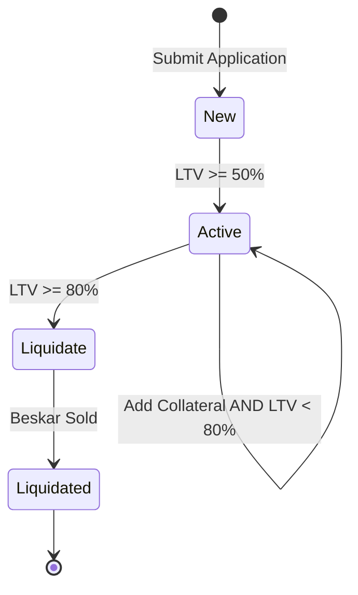

# Ledn's Backend Technical Challenge

## Introduction

Welcome to Ledn's Backend Technical Challenge! This challenge was designed to try to reproduce challenges Ledn faces actively.

To make this experience engaging and relevant, we've infused the challenge with a touch drawing inspiration from the Star Wars theme.

You are **welcome** to email your contact at Ledn if you have any questions about the challenge.

## Background

Across the galaxy, life thrives on billions of planets, yet **Beskar** also known as the legendary Mandalorian steel (symbol: BSK), remains one of the rarest and most coveted materials. Renowned for its unparalleled strength, Beskar is impervious to lightsabers and blasters, making it a treasure of immense value.

At Coruscant Bank, we harness the power of Beskar to offer a unique financial service: Beskar-Backed Loans. If you possess Beskar, you can leverage its worth to secure loans in Galactic Credits (symbol: GCS), the universal currency adopted after the fall of the Empire.

Our operations span the galaxy, with key trading hubs in Mos Espa and Black Spire Outpost. These bustling markets provide real-time Beskar price data, enabling us to maintain precision in our lending process. To ensure financial stability, we adhere to a strict rule: borrowers must pledge collateral worth twice the loan amount. This translates to an initial Loan-to-Value (LTV) ratio of 50%.

In essence, the LTV formula is simple: `LTV = (Units of Beskar × Current Price of Beskar) ÷ Loan Amount`. By following this principle, we safeguard against the volatility of Beskar prices while empowering clients to unlock the value of their prized metal.

## Prerequisites

* Node (v22 or higher) and NPM
* Docker or Podman
* LocalStack

## Getting started

1. Create a **private** repository on your personal GitHub account. We ask that you don't fork our repository, or set your repository to **public**, to ensure the integrity of the challenge.
2. Clone your new private repository locally.
3. Copy the contents of this challenge to your new private repository.
4. Add your app to the monorepo using (e.g. `npm init -w ./apps/liquidation-service`).
5. Install dependencies using `npm install`.
6. Fulfill the requirements outlined in this document.
7. Ensure that your code builds, type checks and linting pass, and that your tests pass.
8. Start the application using `docker compose up` or `podman compose up`.
9. Commit and push your work to your private repository.
10. Invite `ledn-reviewer` as a collaborator to your private repository once it is ready for review.
11. Email your contact at Ledn with a confirmation that `ledn-reviewer` has been added as a contributor and your project is ready for review.

We strongly encourage the use of Generative AI in your development process. However, you are still required to demonstrate understanding of the tradeoffs being made in terms of technology choices, design patterns, and ultimately the source code. Keep in mind that you are the ultimate owner of the code you submit to us for review.

## The Challenge: Implement Coruscant Bank's Liquidation Service

This challenge tasks you with building a critical component of Coruscant Bank's financial infrastructure: the **Liquidation Service**.

Your mission is to implement a robust and reliable backend service that handles the lifecycle of Beskar-backed loans, from application to potential liquidation. This service must seamlessly integrate with existing external services, demonstrating your ability to build interconnected systems.

Your liquidation service for Coruscant Bank must:

1. **accept requests** for new loan applications and for posting collateral
2. **subscribe** to prices from two sources to determine which loans to activate or liquidate
3. **liquidates** loans by selling Beskar
4. **emits notifications** when events occur

The lifecycle of a loan at Coruscant Bank is:

Every loan starts as a new application. A new loan can then become active by posting Beskar until its **Loan-to-Value (LTV) ratio is at 50% or lower**.
Active loans are potentially subject to liquidation: as the value of Beskar drops, the LTV of loans increases and any loan that reaches 80% LTV must be liquidated: sufficient Beskar must be sold to recoup the amount of GCS that was disbursed to the client.
To prevent an active loan from liquidation, additional Beskar may be posted. After a loan is liquidated posting Beskar for that loan is no longer accepted.
If your liquidation service implementation fails to liquidate a loan and its LTV exceeds 100%, Coruscant Bank will incur a financial loss.

### Example

#### Scenario 1: Client applies for a 1000 GCS loan and posts 20 BSK

Loan disbursement amount: 1000 GCS
Collateral posted: 20 BSK
Current BSK price: 50 GCS per BSK
Collateral value: 20 BSK × 50 GCS/BSK = 1000 GCS
LTV = 1000 GCS ÷ 1000 GCS = 100% (loan cannot be activated yet)

#### Scenario 1: Client posts additional 20 BSK

Loan disbursement amount: 1000 GCS (same as before)
Additional collateral posted: 20 BSK
Total collateral posted: 40 BSK
Current BSK price: 50 GCS per BSK (same as before)
Collateral value: 40 BSK × 50 GCS/BSK = 2000 GCS
LTV = 1000 GCS ÷ 2000 GCS = 50% (loan can be activated)

#### Scenario 2: BSK drops in price

If BSK price drops to 31.25 GCS:
New collateral value: 40 BSK × 31.25 GCS/BSK = 1250 GCS
New LTV = 1000 GCS ÷ 1250 GCS = 80% (triggers liquidation)

### Functional Requirements

Your implementation of Coruscant Bank's liquidation service must fulfill the following functionalities:

1. **Consume Price Streams**: Continuously ingest real-time price for Beskar from two distinct markets:
    * **Mos Espa**
    * **Black Spire Outpost**

2. **Loan Management API**: Expose RESTful endpoints for bank representatives to:
    * **Register New Loan Applications**: Allow the creation of new loan requests.
    * **Increase Collateral Balance**: Enable clients to post additional Beskar collateral for an existing loan.

3. **Loan Activation**: Automatically mark loans as **active** once 100% of their required Beskar collateral has been successfully posted.

4. **Automated Liquidation**: Identify and liquidate active loans that reach or exceed the **liquidation threshold of 80% LTV**. When a loan is liquidated, your service must sell just enough collateral to cover the disbursed loan amount.

5. **Notifications**: Upon successful application, activation, or liquidation of a loan, simultaneously notify Coruscant Bank by publishing events to the `coruscant-bank-loan-events` SNS topic.

### Non-Functional Requirements

Your solution must adhere to the following critical constraints:

* **Interoperability**: You must adhere to schema definitions strictly.
* **Idempotency**: A loan **must not be liquidated more than once**.
* **Consistency**: It **must not be possible to post collateral for a loan that has already been liquidated**.
* **Robustness**: It must handle **unexpected inputs** gracefully without crashing.
* **Resiliency**: Once the liquidation process begins for a loan, it **must continue** even if the loan's LTV temporarily drops below the liquidation threshold during the process, or because of failures when selling the collateral.
* **Auditing**: A complete history of all operations (loan applications, collateral postings, liquidations, trade orders) must be meticulously kept. It's not necessary to implement endpoints to see this data.
* **Scalability**: It must be **possible** to run multiple instances of the service without interference.

### Out Of Scope

You are **not required** to do the following:

* Implement a user interface for your liquidation service
* Detect and handle flash crashes on the price of BSK
* Calculate interest accrual on loaned amounts
* Adding a spread, padding prices, or charging fees when selling Beskar
* Implement an accounting system to handle movement of BSK or GCS
* Returning collateral after liquidating a loan

### External Integration Notes

Requests to sell Beskar for liquidation purposes must be made using HTTP requests to either Mos Espa or Black Spire Outpost. Be prepared for real-world scenarios: these external trading services are designed to **randomly slow down or fail approximately 30% of the time**.
## Evaluation Criteria

Your solution will be evaluated on the following aspects:

* **Correctness and Completeness**: How accurately and thoroughly does your service meet all specified requirements and constraints?
* **System Integration**: Demonstrate robust and resilient integration with the provided external services, including handling their simulated failures gracefully.
* **Error Handling and Resiliency**: How well does your service handle unexpected scenarios, such as network failures, invalid inputs, and external service outages?
* **Code Quality**: Readability, maintainability, modularity, project structure, and adherence to best practices.
* **Scalability and Performance Considerations**: While not a full-scale production system, consider how your design choices would impact scalability and performance.
* **Testing**: Evidence of comprehensive unit, and integration tests to ensure the reliability of your service.
* **Documentation**: Clear and concise documentation explaining your architecture, design choices, and how to run and test your solution.
* **Observability**: Ensure the service is designed to allow effective diagnosis of issues that span across multiple services. This includes implementing mechanisms for monitoring and tracking the health and behavior of the system.
* **Generative AI**: How well do you leverage the use of AI to your advantage.

As part of this challenge, you will be provided with source code and a Compose file to spin up several existing services. Your solution **must integrate with these services** but **must not modify or use their internal source code directly**. We will make use of LocalStack to emulating some AWS cloud services locally.

### Coruscant Bank OTC Service

This service simulates client activity and interactions with the bank.

* **Client Activity**: Simulates multiple bank representatives registering loan applications and accepting Beskar from clients.
* **Loan Events**: Subscribed to events published on the SNS topic `coruscant-bank-loan-events`.
  * **Schema for Loan Application Event**:
    * `eventId`: A `string` identifying the unique event.
    * `eventType`: `application`
    * `loanId`: A `string` representing the unique loan.
    * `amount`: A `string` representing the amount of GCS the client requests as disbursement.
    * `status`: `new`
  * **Schema for Loan Activation Event**:
    * `eventId`: A `string` identifying the unique event.
    * `eventType`: `activation`
    * `loanId`: A `string` representing the unique loan.
    * `status`: `active`
    * `outstandingBalance`: A `string` representing any outstanding balance in GCS.
  * **Schema for Loan Liquidation Event**:
    * `eventId`: A `string` identifying the unique event.
    * `eventType`: `liquidation`
    * `loanId`: A `string` representing the unique loan.
    * `collateralSold`: A `string` representing units of collateral that were sold.
    * `collateralValue`: A `string` representing the value of the collateral sold in GCS.
    * `remainingCollateral`: A `string` representing units of collateral that ought to be returned to the client.
    * `outstandingBalance`: A `string` representing any outstanding balance in GCS.
    * `status`: `liquidated`
* **New Loan Applications**: Sends new loan application requests to your liquidation service using HTTP.
* **Collateral Top-ups**: Sends requests to increase collateral balance to your liquidation service using HTTP.

### Trading Service (Mos Espa, Tatooine)

This service manages an order book and simulates trading activity for Beskar on Tatooine.

* **Order Book & Trading Simulation**: Manages an order book and simulates market actors.
* **Price Events**: Publishes price events to the SNS topic `tatooine-mos-espa-prices`.
  * **Schema**:
    * `eventId`: A `string` identifying the unique price event. Used for log correlation.
    * `asset`: `BESKAR`
    * `currency`: `GC`
    * `timestamp`: `string` representing the date since Battle of Yavin in RFC 3339 format.
    * `levels`: An `array` of price levels.
      * `quantity`: `1`, `10`, `50`, or `100` units of Beskar.
      * `buy`: A `string` with the effective price of buying a given `quantity` of the asset.
      * `sell`: A `string` with the effective price of selling a given `quantity` of the asset.
* **Trade Orders**: Accepts trade orders via HTTP POST.

### Trading Service (Black Spire Outpost, Batuu)

This service also manages an order book and simulates trading activity, but specifically for Black Spire Outpost on Batuu.

* **Order Book & Trading Simulation**: Manages an order book and simulates market actors.
* **Price Events**: Publishes prices to the SNS topic `batuu-black-spire-outpost-price-stream`.
  * **Schema**:
    * `item`: `BSK` or other.
    * `time`: `number` of seconds since the Battle of Yavin (same as UNIX Timestamp).
    * `buy`: An `array` of buy price levels.
      * `amount`: `1`, `10`, `50`, or `100` units.
      * `price`: A `number` with the effective price of buying a given `amount` of the asset.
    * `sell`: An `array` of sell price levels.
      * `amount`: `1`, `10`, `50`, or `100` units.
      * `price`: A `number` with the effective price of selling a given `amount` of the asset.
* **Trade Orders**: Accepts trade orders via HTTP POST.
